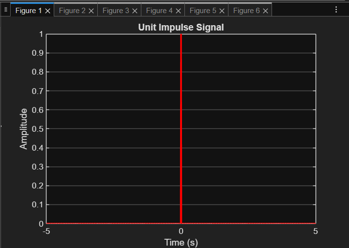
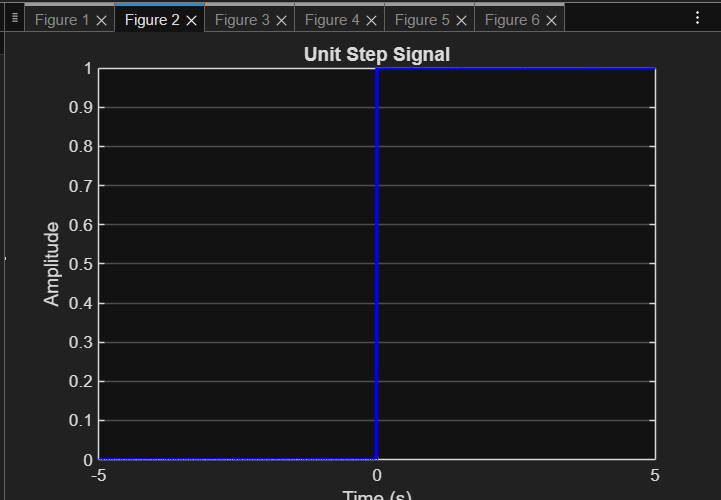
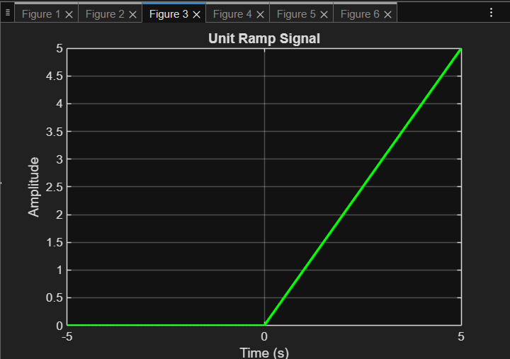
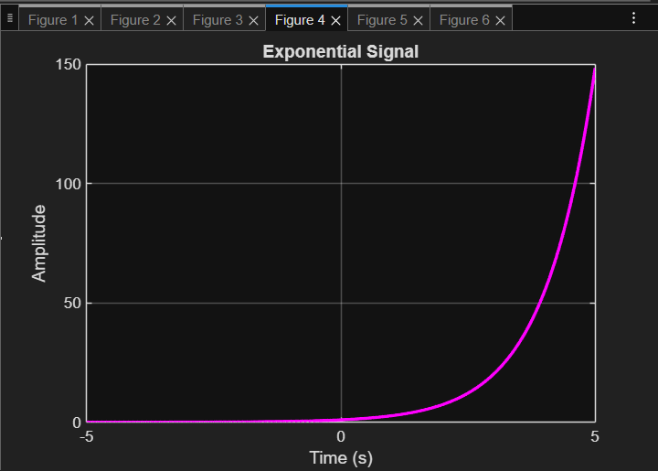
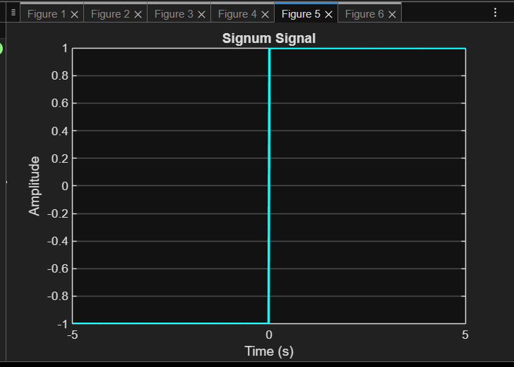
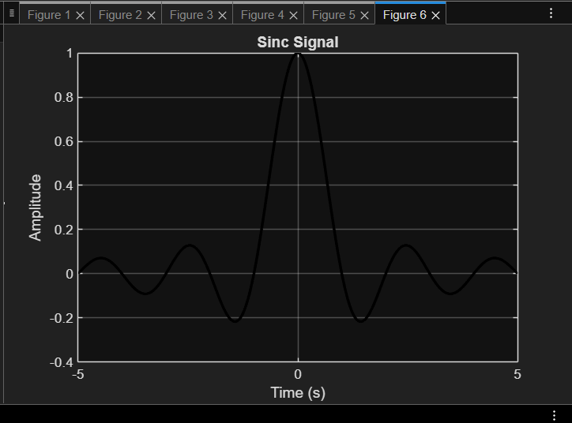

# Week 2 – Continuous-Time Signals in MATLAB

This repository contains MATLAB code to generate and visualize common **continuous-time signals**. The signals are implemented in `signals.m` and plotted using the `plot()` function.

---

## 📊 Continuous-Time Signals Implemented

### 1. Unit Impulse (δ(t))
- Defined as:
  \[
  \delta(t) =
  \begin{cases}
  \infty, & t = 0 \\
  0, & t \neq 0 \\
  \int_{-\infty}^{\infty} \delta(t)\,dt = 1
  \end{cases}
  \]
- In MATLAB, this is approximated using a spike at \(t = 0\).

---

### 2. Unit Step (u(t))
- Defined as:
  \[
  u(t) =
  \begin{cases}
  1, & t \geq 0 \\
  0, & t < 0
  \end{cases}
  \]
- A signal that “turns on” at \(t = 0\).

---

### 3. Unit Ramp (r(t))
- Defined as:
  \[
  r(t) =
  \begin{cases}
  t, & t \geq 0 \\
  0, & t < 0
  \end{cases}
  \]
- A signal that increases linearly with time.

---

### 4. Exponential Signal
- General form:
  \[
  x(t) = e^{at}, \quad a \in \mathbb{R}
  \]
- Example used: \( a = -1 \) (decaying exponential).

---

### 5. Signum Function (sgn(t))
- Defined as:
  \[
  \text{sgn}(t) =
  \begin{cases}
  1, & t > 0 \\
  0, & t = 0 \\
  -1, & t < 0
  \end{cases}
  \]
- Shows the sign of the time variable.

---

### 6. Sinc Function
- Defined as:
  \[
  \text{sinc}(t) = \frac{\sin(\pi t)}{\pi t}, \quad t \neq 0; \quad \text{sinc}(0) = 1
  \]
- Commonly used in communications and signal processing.

---

## 📷 Sample Plots

Below are example outputs generated by MATLAB (exported using `saveas`):

### Unit Impulse


### Unit Step


### Unit Ramp


### Exponential Signal


### Signum Function


### Sinc Function


---

## ▶️ How to Run

1. Clone the main repository:
   ```bash
   git clone https://github.com/vincentbui21/MathematicalAlgorithms.git
   cd MathematicalAlgorithms/week2-signals-matlab
