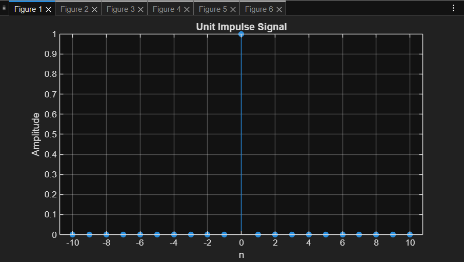
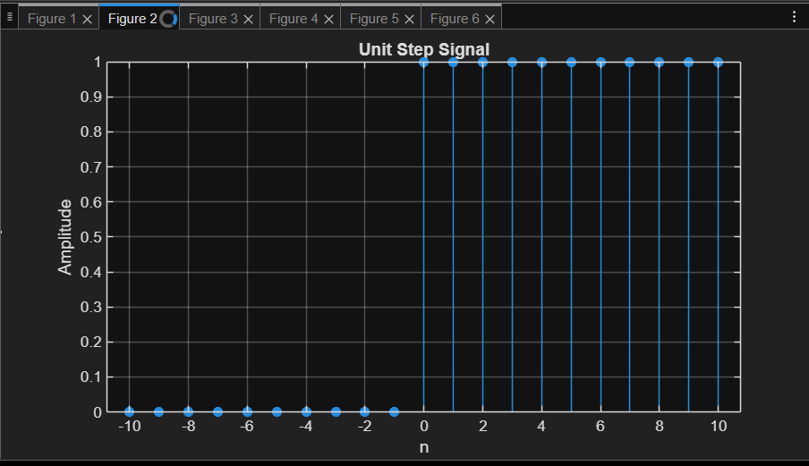
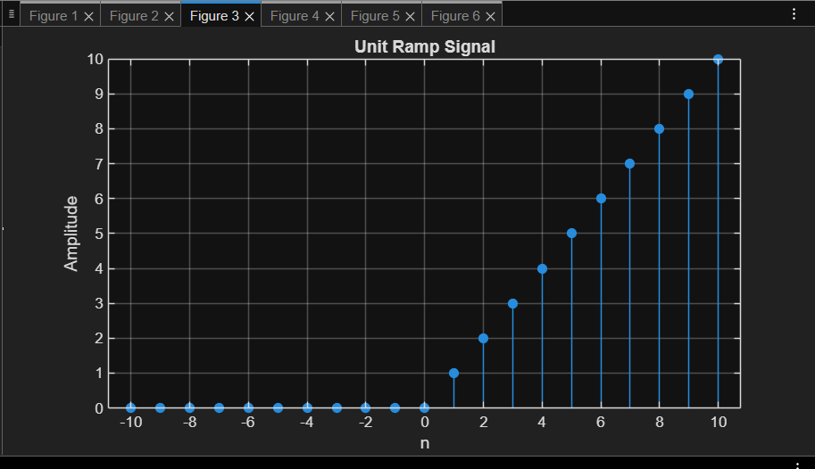
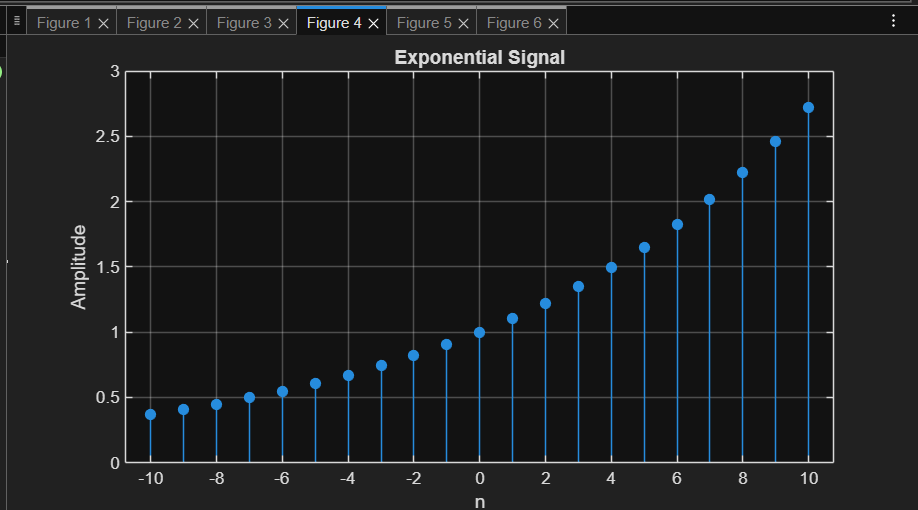
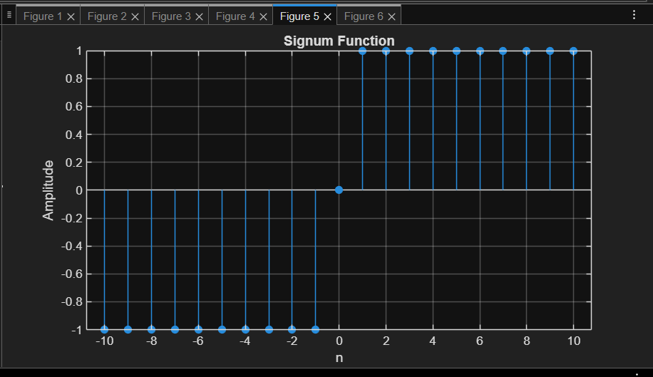
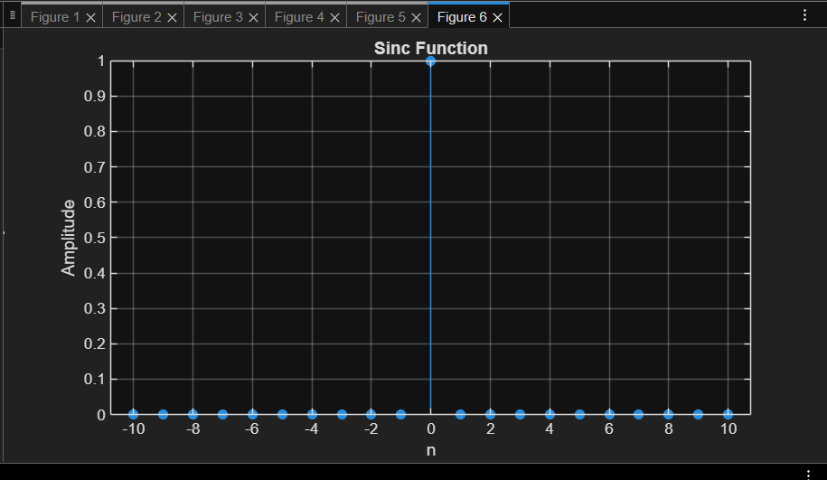

# Week 3 – Discrete Signals in MATLAB

This repository contains MATLAB code to generate and visualize common **discrete-time signals**. The signals are implemented in `discrete_signals.m` and plotted using the `stem()` function.

---

## 📊 Discrete-Time Signals Implemented

### 1. Unit Impulse (δ[n])
- Defined as:
  \[
  \delta[n] =
  \begin{cases}
  1, & n = 0 \\
  0, & n \neq 0
  \end{cases}
  \]
- A signal with a single spike at \(n = 0\).

---

### 2. Unit Step (u[n])
- Defined as:
  \[
  u[n] =
  \begin{cases}
  1, & n \geq 0 \\
  0, & n < 0
  \end{cases}
  \]
- A signal that "turns on" at \(n = 0\).

---

### 3. Unit Ramp (r[n])
- Defined as:
  \[
  r[n] =
  \begin{cases}
  n, & n \geq 0 \\
  0, & n < 0
  \end{cases}
  \]
- A signal that grows linearly with \(n\).

---

### 4. Exponential Signal
- General form:
  \[
  x[n] = a^n, \quad a > 0
  \]
- Example used: \( a = 0.9 \) (decaying exponential).

---

### 5. Signum Function (sgn[n])
- Defined as:
  \[
  \text{sgn}[n] =
  \begin{cases}
  1, & n > 0 \\
  0, & n = 0 \\
  -1, & n < 0
  \end{cases}
  \]
- Shows the sign of each integer \(n\).

---

### 6. Sinc Function
- Defined as:
  \[
  \text{sinc}[n] = \frac{\sin(\pi n)}{\pi n}, \quad n \neq 0; \quad \text{sinc}[0] = 1
  \]
- A commonly used function in signal processing.

---

## 📷 Sample Plots

Below are example outputs generated by MATLAB (exported using `saveas`):

### Unit Impulse


### Unit Step


### Unit Ramp


### Exponential Signal


### Signum Function


### Sinc Function



---

## ▶️ How to Run

1. Clone this repository:
   ```bash
   git clone https://github.com/vincentbui21/week3-discrete-signals-matlab.git
   cd week3-discrete-signals-matlab
